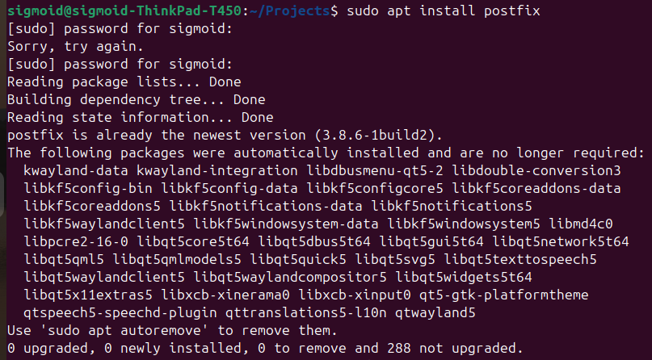
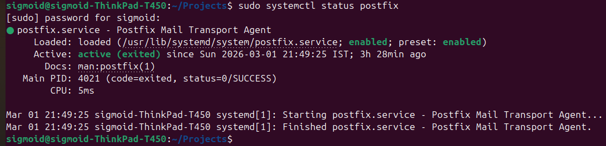
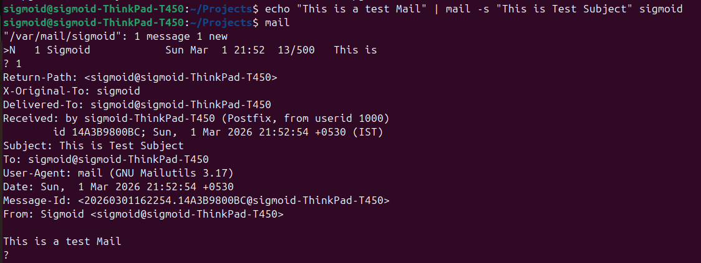

# Task 1 - SMTP Configuration on Localhost

## What is SMTP?
SMTP (Simple Mail Transfer Protocol) is used to send emails. 
Here we configure the Linux system itself as a local mail server 
so users can send/receive emails locally.

---

## Steps Performed

### Step 1 - Update the system
```bash
sudo apt update
```

### Step 2 - Install Postfix (SMTP Server)
```bash
sudo apt install postfix -y
```
> During installation select **"Local only"** when prompted.



### Step 3 - Install Mailutils
```bash
sudo apt install mailutils -y
```
> Mailutils allows us to send and read mails from the terminal.

### Step 4 - Check Postfix is Running
```bash
sudo systemctl status postfix
```


### Step 5 - Send a Test Mail
```bash
echo "This is a Test mail" | mail -s "This is Test Subject" root
```

### Step 6 - Read the Mail
```bash
mail
```
> Type **1** to read the mail, type **q** to quit.



---

## Result
Mail was successfully sent and received on localhost. ✅
