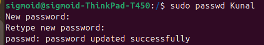
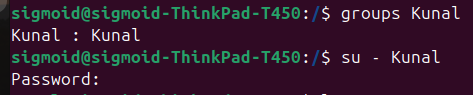
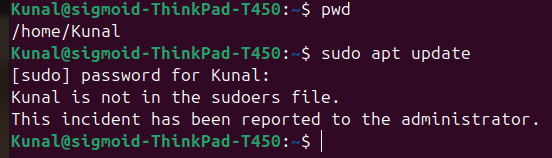

# Task 2 - Create a User Without Sudo Access

## Concept
In Linux there are two types of users:
- **Sudo users** - can run admin commands using `sudo`
- **Normal users** - can only run basic commands, cannot use `sudo`

In this task we create a user that cannot execute any sudo commands.

---

## Steps Performed

### Step 1 - Create a New User
```bash
sudo useradd -m -s /bin/bash Kunal
```
> `-m` creates a home directory | `-s /bin/bash` gives bash shell access

### Step 2 - Set Password for the User
```bash
sudo passwd Kunal
```


### Step 3 - Verify User is NOT in Sudo Group
```bash
groups Kunal
```
> Output should only show `Kunal : Kunal` — no sudo in the list



### Step 4 - Switch to the User
```bash
su - Kunal
```
> This switches you into Kunal's session

### Step 5 - Test Sudo Access
```bash
sudo apt update
```
> Expected output:
```
Kunal is not in the sudoers file.
This incident has been reported to the administrator.
```



---

## Result
User **Kunal** was successfully created without sudo privileges. 
Any attempt to run sudo commands is blocked and reported. ✅
