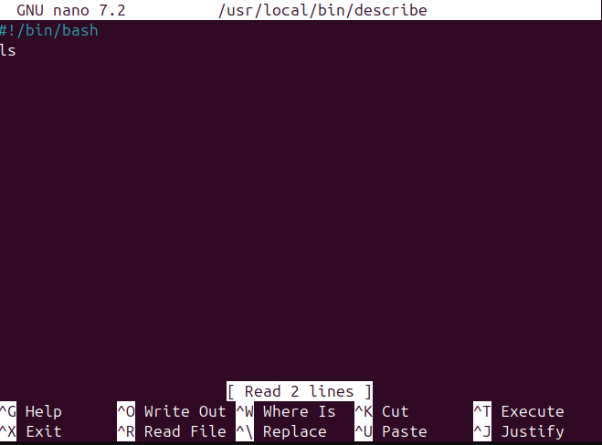
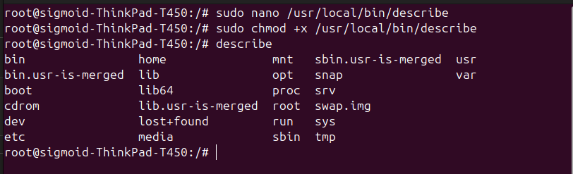
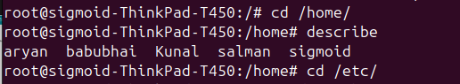
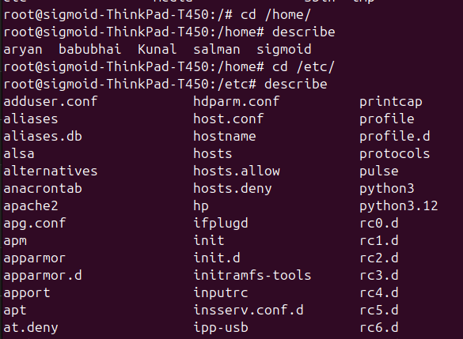
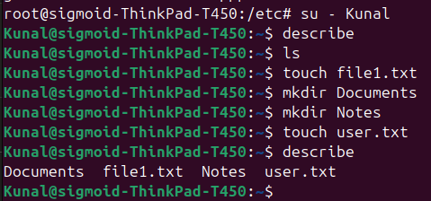

# Task 3 - Create a Custom `describe` Command

## Concept
In Linux, commands like `ls` and `pwd` work from anywhere because 
they are stored in `/usr/local/bin/` which Linux checks automatically.

We created our own custom command called `describe` that:
- Works from **anywhere** in the system
- Works for **any user** (root, normal users)
- Lists all files and folders of the user's current directory

---

## Steps Performed

### Step 1 - Create the describe script
```bash
sudo nano /usr/local/bin/describe
```
> Wrote the following inside the file:
```bash
#!/bin/bash
ls
```
> `#!/bin/bash` → tells Linux this is a bash script
> `ls` → lists all files and folders of current directory



### Step 2 - Give Execute Permission
```bash
sudo chmod +x /usr/local/bin/describe
```
> This makes the script executable by any user on the system

### Step 3 - Test from Root Directory `/`
```bash
describe
```
> Listed all files and folders of root directory



### Step 4 - Test from `/home` directory
```bash
cd /home
describe
```
> Output showed: `aryan  babubhai  Kunal  salman  sigmoid`



### Step 5 - Test from `/etc` directory
```bash
cd /etc
describe
```
> Listed all config files inside /etc directory



### Step 6 - Test with Normal User (Kunal)
```bash
su - Kunal
describe
```
> Created some files and folders first:
```bash
touch file1.txt
mkdir Documents
mkdir Notes
touch user.txt
```
> Then ran describe:
```bash
describe
```
> Output: `Documents  file1.txt  Notes  user.txt` ✅



---

## Result
Custom `describe` command was successfully created and works:
- ✅ From any directory in the system
- ✅ For root user
- ✅ For normal users (Kunal)
- ✅ Always lists current directory contents
