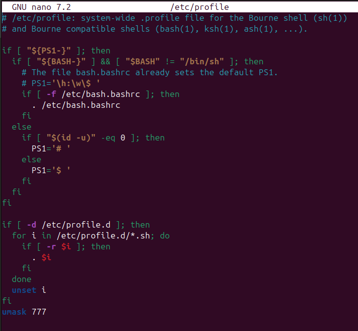
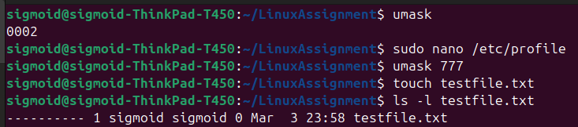
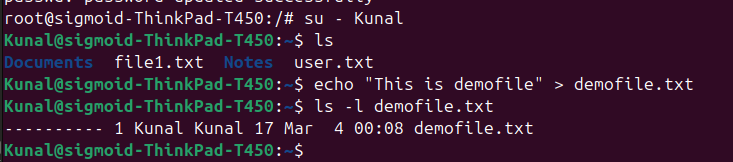

# Task 5 - No Permissions on Newly Created Files (Without chmod)

## Concept
Normally when a file is created in Linux it gets default permissions 
like `rw-r--r--` (644). 

In this task we configure the system so that any user creates a file,
it should have **zero permissions automatically** — without using chmod.

## Solution - umask
`umask` is a value that automatically controls default permissions 
of newly created files. It acts as a filter that removes permissions.

| umask value | File permissions result |
|---|---|
| `umask 000` | `rw-rw-rw-` (666) - full permissions |
| `umask 022` | `rw-r--r--` (644) - default Linux |
| `umask 777` | `----------` (000) - zero permissions |

Setting `umask 777` means no permissions at all on new files.

---

## Steps Performed

### Step 1 - Check Current umask Value
```bash
umask
```
> Default output: `0002`

### Step 2 - Set umask 777 Permanently for All Users
```bash
sudo nano /etc/profile
```
> Added at the bottom of the file:
```bash
umask 777
```
> This ensures every user gets umask 777 on login permanently.



### Step 3 - Apply in Current Session
```bash
umask 777
```

### Step 4 - Test with sigmoid user
```bash
touch testfile.txt
ls -l testfile.txt
```
> Output:
```
---------- 1 sigmoid sigmoid 0 Mar 3 23:58 testfile.txt
```



### Step 5 - Test with Kunal user
```bash
su - Kunal
echo "This is demofile" > demofile.txt
ls -l demofile.txt
```
> Output:
```
---------- 1 Kunal Kunal 17 Mar 4 00:08 demofile.txt
```



---

## Result
- ✅ `umask 777` set permanently in `/etc/profile`
- ✅ New files created by **sigmoid** user have zero permissions
- ✅ New files created by **Kunal** user have zero permissions
- ✅ `chmod` command was NOT used at any point
