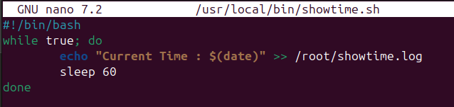
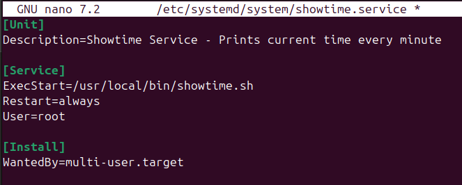
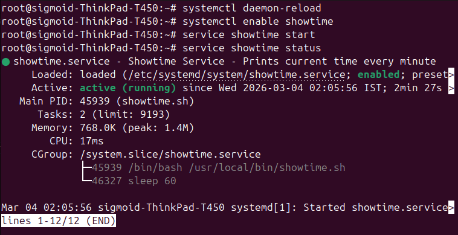
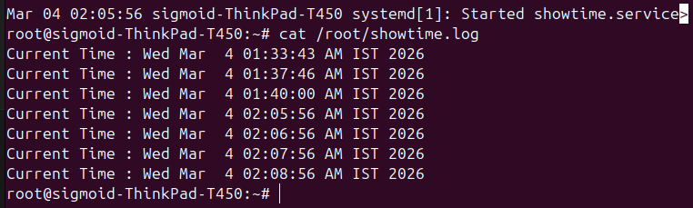
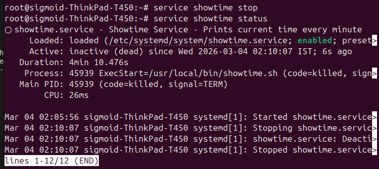

# Task 6 - Create a Custom `showtime` Service

## Concept
In Linux, `systemd` is the service manager that controls all services.
We created a custom service called `showtime` that writes the current 
time to a file every minute and can be started, stopped and checked 
like any other Linux service.

---

## Files Created

### 1. Script File - `/usr/local/bin/showtime.sh`
```bash
#!/bin/bash
while true; do
    echo "Current Time : $(date)" >> /root/showtime.log
    sleep 60
done
```
> `while true` → keeps running until stopped  
> `date` → gets current time  
> `>> /root/showtime.log` → appends time to log file in root's home  
> `sleep 60` → waits 60 seconds before writing again

### 2. Service File - `/etc/systemd/system/showtime.service`
```bash
[Unit]
Description=Showtime Service - Prints current time every minute

[Service]
ExecStart=/usr/local/bin/showtime.sh
Restart=always
User=root

[Install]
WantedBy=multi-user.target
```

---

## Steps Performed

### Step 1 - Create the Script
```bash
nano /usr/local/bin/showtime.sh
chmod 755 /usr/local/bin/showtime.sh
```


### Step 2 - Create the Service File
```bash
nano /etc/systemd/system/showtime.service
```


### Step 3 - Reload systemd and Enable Service
```bash
systemctl daemon-reload
systemctl enable showtime
```
> Output: `Created symlink /etc/systemd/system/multi-user.target.wants/showtime.service`

### Step 4 - Start the Service
```bash
service showtime start
service showtime status
```
> Output: `Active: active (running)`



### Step 5 - Verify Time is Written to Log File
```bash
cat /root/showtime.log
```
> Output:
```
Current Time : Wed Mar  4 01:33:43 AM IST 2026
Current Time : Wed Mar  4 01:37:46 AM IST 2026
Current Time : Wed Mar  4 01:40:00 AM IST 2026
```



### Step 6 - Stop the Service
```bash
service showtime stop
service showtime status
```
> Output: `Active: inactive (dead)`



---

## Result
- ✅ `showtime` service created successfully
- ✅ Service writes current time every minute to `/root/showtime.log`
- ✅ `service showtime start` → starts writing time
- ✅ `service showtime stop` → stops writing
- ✅ `service showtime status` → shows current status
